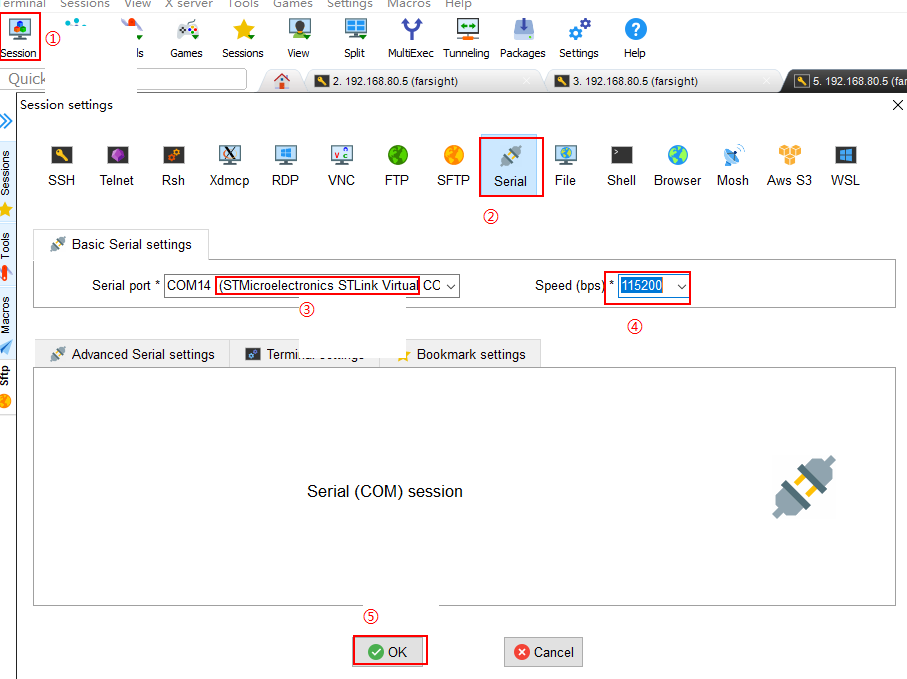
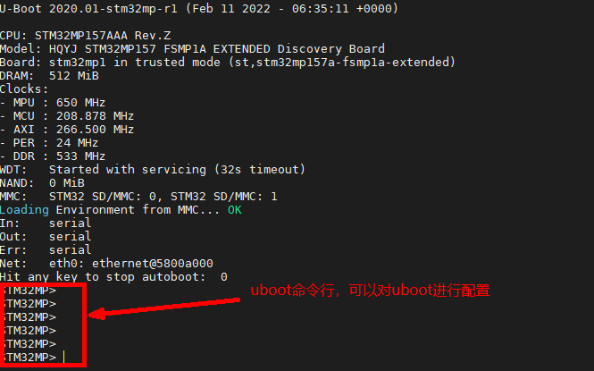

搭建开发环境

#### 一，检测ubuntu中相关服务是否安装配置OK

1，samba服务  ----//如果没安装，参考：ubuntu18.04服务配置_v2.pdf

2，tftp服务 ----//如果没安装，参考：ubuntu18.04服务配置_v2.pdf

3，nfs服务 ----//如果没安装，参考：ubuntu18.04服务配置_v2.pdf


#### 二，将 ubuntu中/tftpboot 和 /opt 两个目录设置共享目录

```
1，打开samba配置文件
	sudo vim /etc/samba/smb.conf
2,在文件末尾添加下面内容
	[tftpboot]
    path = /tftpboot
    browseable = yes
    public = yes
    available = yes
    writable = yes
    
    [opt]
    path = /opt
    browseable = yes
    public = yes
    available = yes
    writable = yes
3,重启samba服务
	 sudo /etc/init.d/smbd restart
```

#### 三，将内核镜像和设备树文件拷贝到 ubuntu中

```
1，进入 “初级驱动\源码\编译好的文件”
2，找到内核镜像文件和设备树文件	
	uImage                           //内核镜像文件
	stm32mp157a-fsmp1a.dtb           //设备树文件
3，将上面两个文件拷贝到 ubuntu的 /tftpboot
	farsight@ubuntu:~$ ls /tftpboot/		 //检测/tftpboot中是否拷贝成功
    1.txt  stm32mp157a-fsmp1a.dtb  uImage
    farsight@ubuntu:~$
```

#### 四，将文件系统rootfs拷贝到ubuntu中

```
1，拷贝rootfs到ubuntu的/opt
	D:\peter\2306\初级驱动\源码\编译好的文件\rootfs.tar.xz  ----》 /opt
	
	//如果提示没有权限---》解决方法：sudo chmod 777 /opt/ 
2,在ubuntu中，进入/opt， 解压rootfs
	cd /opt/
	tar -xvf rootfs.tar.xz
3，打开nfs服务配置文件
	sudo vim /etc/exports
4，在文件末尾添加
	/opt/rootfs    *(rw,sync,no_root_squash,no_subtree_check)
	
5, 重启nfs服务
	sudo /etc/init.d/nfs-kernel-server restart
```

#### 五，连接并启动开发板

##### 1，连接开发板

​	

##### 2，重启开发板

```
INFO:    SP_MIN: Initializing runtime services
INFO:    SP_MIN: Preparing exit to normal world


U-Boot 2020.01-stm32mp-r1 (Feb 11 2022 - 06:35:11 +0000)

CPU: STM32MP157AAA Rev.Z
Model: HQYJ STM32MP157 FSMP1A EXTENDED Discovery Board
Board: stm32mp1 in trusted mode (st,stm32mp157a-fsmp1a-extended)
DRAM:  512 MiB
Clocks:
- MPU : 650 MHz
- MCU : 208.878 MHz
- AXI : 266.500 MHz
- PER : 24 MHz
- DDR : 533 MHz
WDT:   Started with servicing (32s timeout)
NAND:  0 MiB
MMC:   STM32 SD/MMC: 0, STM32 SD/MMC: 1
Loading Environment from MMC... OK
In:    serial
Out:   serial
Err:   serial
Net:   eth0: ethernet@5800a000
Hit any key to stop autoboot:  0
STM32MP>
STM32MP>
重启开发板后，快速按回车键，进入uboot的命令行，如下图：
```



##### 3，设置uboot参数

```
STM32MP> setenv serverip 192.168.70.5
STM32MP> setenv ipaddr 192.168.70.7
STM32MP> setenv gatewayip 192.168.70.1
STM32MP> setenv bootcmd tftp 0xc2000000 uImage\;tftp 0xc1000000 stm32mp157a-fsmp1a.dtb \;bootm 0xc2000000 - 0xc1000000
STM32MP> setenv bootargs root=/dev/nfs nfsroot=192.168.70.5:/opt/rootfs ip=192.168.70.7 rootwait rw earlyprintk console=ttySTM0,115200 init=/linuxrc
STM32MP> saveenv
```

##### 4，重启开发板，观察结果

```
ssh-keygen: generating new host keys: RSA
DSA ECDSA ED25519
Starting sshd: /var/empty must be owned by root and not group or world-writable.
OK

Welcome to HQYJ
farsight login: root         //输入账号: root
Password:                    //配置buildroot时设置的密码,比如:1
# ls
# cd /
# ls
bin      lib      media    proc     sbin     usr
dev      lib32    mnt      root     sys      var
etc      linuxrc  opt      run      tmp
#

1》命令行显示用户名和主机名
	1) 打开开发板挂载的文件系统中/etc/profile文件
		vim /opt/rootfs/etc/profile
	2）在文件后面添加下面内容
        export HOSTNAME=farsight
        export USER=root
        export HOME=root
        export PS1="[$USER@$HOSTNAME \W]\# "
        PATH=/bin:/sbin:/usr/bin:/usr/sbin
        LD_LIBRARY_PATH=/lib:/usr/lib:$LD_LIBRARY_PATH
        export PATH  LD_LIBRARY_PATH
    
    
2》去掉登录的账号和密码
	1） 打开开发板挂载的文件系统中/etc/inittab文件
	  vim /opt/myrootfs/etc/inittab
	2) 添加下面一行
	  21 #::sysinit:/sbin/swapon -a           //注释掉这行
 	  22 ::sysinit:-/bin/sh                   //添加该行
 	  
重启开发板，观察：
[    3.274957] stm32-dwmac 5800a000.ethernet eth0: registered PTP clock
[    3.280990] stm32-dwmac 5800a000.ethernet eth0: configuring for phy/rgmii-id link mode
[    6.407835] stm32-dwmac 5800a000.ethernet eth0: Link is Up - 100Mbps/Full - flow control rx/tx
[    6.466048] IP-Config: Guessing netmask 255.255.255.0
[    6.469632] IP-Config: Complete:
[    6.472860]      device=eth0, hwaddr=00:80:e1:42:60:10, ipaddr=192.168.70.7, mask=255.255.255.0, gw=255.255.255.255
[    6.483341]      host=192.168.70.7, domain=, nis-domain=(none)
[    6.489198]      bootserver=255.255.255.255, rootserver=192.168.70.5, rootpath=
[    6.497837] ALSA device list:
[    6.499397]   #0: STM32MP1-FSMP1A
[    7.553058] VFS: Mounted root (nfs filesystem) on device 0:17.
[    7.558124] devtmpfs: mounted
[    7.562726] Freeing unused kernel memory: 1024K
[    7.606428] Run /linuxrc as init process
[root@HQYJ ]#
[root@HQYJ ]#
[root@HQYJ ]# ls
bin      lib      media    proc     sbin     usr
dev      lib32    mnt      root     sys      var
etc      linuxrc  opt      run      tmp
```

#### 六，配置(安装)交叉编译器

##### 1，在ubuntu中创建相关目录

```
farsight@ubuntu:~$ mkdir mp157
farsight@ubuntu:~$ cd mp157/
farsight@ubuntu:~/mp157$ mkdir kernel  driver  tools
```

##### 2，将交叉工具链拷贝到tools中

```
初级驱动\工具\en.SDK-x86_64-stm32mp1-openstlinux-5.4-dunfell-mp1-20-06-24.tar.xz
```

##### 3，解压上面的交叉工具链

```
tar -xvf en.SDK-x86_64-stm32mp1-openstlinux-5.4-dunfell-mp1-20-06-24.tar.xz
```

##### 4，进入解压后的目录，安装交叉工具链

```
1，进入解压后的目录
farsight@ubuntu:~/mp157/tools$ cd stm32mp1-openstlinux-5.4-dunfell-mp1-20-06-24/sdk/
farsight@ubuntu:~/mp157/tools/stm32mp1-openstlinux-5.4-dunfell-mp1-20-06-24/sdk$ ls
st-image-weston-openstlinux-weston-stm32mp1-x86_64-toolchain-3.1-openstlinux-5.4-dunfell-mp1-20-06-24.host.manifest
st-image-weston-openstlinux-weston-stm32mp1-x86_64-toolchain-3.1-openstlinux-5.4-dunfell-mp1-20-06-24.license
st-image-weston-openstlinux-weston-stm32mp1-x86_64-toolchain-3.1-openstlinux-5.4-dunfell-mp1-20-06-24-license_content.html
st-image-weston-openstlinux-weston-stm32mp1-x86_64-toolchain-3.1-openstlinux-5.4-dunfell-mp1-20-06-24.sh
st-image-weston-openstlinux-weston-stm32mp1-x86_64-toolchain-3.1-openstlinux-5.4-dunfell-mp1-20-06-24.target.manifest
st-image-weston-openstlinux-weston-stm32mp1-x86_64-toolchain-3.1-openstlinux-5.4-dunfell-mp1-20-06-24.testdata.json
2，执行安装程序
	1》创建安装交叉工具链的目录
	mkdir /opt/sdk
	sudo chmod 777 /opt
	2》执行安装程序
	./st-image-weston-openstlinux-weston-stm32mp1-x86_64-toolchain-3.1-openstlinux-5.4-dunfell-mp1-20-06-24.sh
	安装过程如下：
	ST OpenSTLinux - Weston - (A Yocto Project Based Distro) SDK installer version 3.1-openstlinux-5.4-dunfell-mp1-20-06-24
=======================================================================================================================
Enter target directory for SDK (default: /opt/st/stm32mp1/3.1-openstlinux-5.4-dunfell-mp1-20-06-24): /opt/sdk             //指定要安装的位置:  /opt/sdk
You are about to install the SDK to "/opt/sdk". Proceed [Y/n]? y
Extracting SDK...............................................
.................................................................................................................done
Setting it up...done
SDK has been successfully set up and is ready to be used.
Each time you wish to use the SDK in a new shell session, you need to source the environment setup script e.g.
 $ . /opt/sdk/environment-setup-cortexa7t2hf-neon-vfpv4-ostl-linux-gnueabi

```

##### 5，测试交叉工具链是否安装OK

```
1，导入交叉工具链  ----当打开一个新的终端时需要导入，当执行make之前导入
farsight@ubuntu:~$ source /opt/sdk/environment-setup-cortexa7t2hf-neon-vfpv4-ostl-linux-gnueabi
2，查看版本
farsight@ubuntu:~$ $CC --version
arm-ostl-linux-gnueabi-gcc (GCC) 9.3.0
Copyright (C) 2019 Free Software Foundation, Inc.
This is free software; see the source for copying conditions.  There is NO
warranty; not even for MERCHANTABILITY or FITNESS FOR A PARTICULAR PURPOSE.
//能够查看到版本信息，则说明安装成功
```

##### 6，交叉编译c程序，并在开发板运行

```
1，交叉编译a.c
farsight@ubuntu:~$ $CC -o a a.c
2,查看可执行程序的属性
farsight@ubuntu:~$ file a
a: ELF 32-bit LSB executable, ARM, EABI5 version 1 (SYSV), dynamically linked, interpreter /lib/ld-linux-armhf.so.3, BuildID[sha1]=d08029fba6614d6218a76f40ee7975755ed5b72f, for GNU/Linux 3.2.0, with debug_info, not stripped

3，将编译的a拷贝到 /opt/rootfs
	cp a /opt/rootfs
	
4，在开发板中运行
	[root@fsmp1a ]# ./a
	hello world

```

#### 七，内核移植(编译)

##### 1，获取内核源码

```
1》从官网获取
	https://mirrors.edge.kernel.org/pub/linux/kernel/v5.x/   -----原厂工程师
	
2》从芯片原厂
	三星，高通，MTK，海思，RK，全志，ST等	  ------产品工程师
	
```

##### 2，移植linux内核源码

###### 2.1  将内核源码拷贝到ubuntu中，并解压

```
1》解压
tar -xvf en.SOURCES-stm32mp1-openstlinux-5-4-dunfell-mp1-20-06-24.tar.xz

2》进入linux-stm32mp-5.4.31-r0，解压标准的内核源码
	cd stm32mp1-openstlinux-5.4-dunfell-mp1-20-06-24/sources/arm-ostl-linux-gnueabi/linux-stm32mp-5.4.31-r0
	tar -xvf linux-5.4.31.tar.xz     //解压标准内核源码
```

###### 2.2 打补丁

```
1》进入内核源码目录
	cd linux-5.4.31/
2》打补丁
	for p in `ls -1 ../*.patch`; do patch -p1 < $p; done
```

###### 2.3 生成标准板配置文件

```
先导入交叉工具链
	source /opt/sdk/environment-setup-cortexa7t2hf-neon-vfpv4-ostl-linux-gnueabi

1》  生成 multi_v7_defconfig 默认配置
		make ARCH=arm multi_v7_defconfig "fragment*.config"
		
2》在默认 multi_v7_defconfig 配置中加入 ST 官方提供的 fragment config
		for f in `ls -1 ../fragment*.config`; do scripts/kconfig/merge_config.sh -m -r .config $f; done
		yes '' | make ARCH=arm oldconfig
		
3》 生成自己的默认配置文件
		cp .config arch/arm/configs/stm32_fsmp1a_defconfig
		
4》取消 git 中的 SHA1
		echo "" > .scmversion

5》在arch/arm/configs可以查看到开发板要使用的内核配置文件
		peter@ubuntu:~/fs-mp1a/linux/fsmp1a-linux-5.4.31$ ls arch/arm/configs/stm32*
		arch/arm/configs/stm32_defconfig  arch/arm/configs/stm32_fsmp1a_defconfig      

//标准版基本配置已经配置好，在编译前如果需要编译额外的功能或者驱动，可以使用 meunconfig 来对内核进行配置,

6》将配置好的内核源码拷贝到 ~/mp157/kernel
	cp -af linux-5.4.31  ~/mp157/kernel/

7》返回到内核目录 ~/mp157/kernel/ ，并删除其他文件
	cd ~/mp157/kernel/
	rm -r en.SOURCES-stm32mp1-openstlinux-5-4-dunfell-mp1-20-06-24.tar.xz  stm32mp1-openstlinux-5.4-dunfell-mp1-20-06-24/
```

###### 2.4  配置内核

```
1》安装相关的工具(库)：
 sudo apt-get install gawk wget git-core diffstat unzip texinfo gcc-multilib build-essential chrpath socat cpio python python3 python3-pip python3-pexpect xz-utils debianutils iputils-ping
 
 sudo apt-get install libsdl1.2-dev xterm  make xsltproc docbook-utils fop dblatex xmlto python-git-doc ncurses-dev libncurses5-dev libncursesw5-dev lib32ncurses5 libssl-dev linux-headers-generic u-boot-tools device-tree-compiler bison flex g++ libyaml-dev
 
 sudo apt-get install coreutils bsdmainutils sed curl bc lrzsz corkscrew cvs subversion mercurial nfs-common nfs-kernel-server libarchive-zip-perl dos2unix texi2html diffstat libxml2-utils
 ===========================================================================================================

2》配置内核，
	由于内核源码默认配置已经支持 eMMC和网卡，在此列出主要选项，如下：
    linux@ubuntu:$ make menuconfig

	Device Drivers --->
		Generic Driver Options  ---> 
           [*] Support for uevent helper         //支持热插拔，在/proc下生成/proc/sys/kernel/hotplug
    Device Drivers --->
        <*> MMC/SD/SDIO card support --->
           [*] STMicroelectronics STM32 SDMMC Controller

	Device Drivers --->
     [*] Network device support --->
    	[*] Ethernet driver support --->
            <*> STMicroelectronics Multi-Gigabit Ethernet driver
            <*> STMMAC Platform bus support
            <*> Support for snps,dwc-qos-ethernet.txt DT binding.
            <*> Generic driver for DWMAC
            <*> STM32 DWMAC support
```

###### 2.5 编译linux内核源码

```
1》编译内核源码
make ARCH=arm -j4 uImage LOADADDR=0xC2000040

//编译后生成文件uImage,如下：
 LD      arch/arm/boot/compressed/vmlinux
  OBJCOPY arch/arm/boot/zImage
  Kernel: arch/arm/boot/zImage is ready
  UIMAGE  arch/arm/boot/uImage
Image Name:   Linux-5.4.31
Created:      Tue Sep 19 03:15:30 2023
Image Type:   ARM Linux Kernel Image (uncompressed)
Data Size:    7312584 Bytes = 7141.20 KiB = 6.97 MiB
Load Address: c2000040
Entry Point:  c2000040
  Kernel: arch/arm/boot/uImage is ready
  
2》将uImage 拷贝到/tftpboot/
	cp arch/arm/boot/uImage /tftpboot/   //将新编译的uImage拷贝到/tftpboot中
```

#### 八，编译设备树文件

在linux内核源码中，设备树文件一般在： arch/arm/boot/dts/

##### 1，将fsmp157的设备树文件拷贝到linux内核源码中

```

将 D:\peter\23073\初级驱动\源码\设备树文件\ 目录中下面的所有文件 
stm32mp151.dtsi  
stm32mp157a-fsmp1a.dts  
stm32mp15-pinctrl.dtsi  
stm32mp15xx-dkx.dtsi  
stm32mp15xx-fsmp1x.dtsi

拷贝到： linux内核源码的 arch/arm/boot/dts/ 目录中
```

2，修改 arch/arm/boot/dts/Makefile

```
1》打开Makefile
	vim arch/arm/boot/dts/Makefile

2>添加下面一行
	992         stm32mp157a-fsmp1a.dtb\
	
```

##### 3，编译设备树文件	

```
1》指定编译某个设备树文件：
	make ARCH=arm -j4  stm32mp157a-fsmp1a.dtb LOADADDR=0xC2000040

2》编译 arch/arm/boot/dts/中所有的设备树文件
	make ARCH=arm -j4  dtbs LOADADDR=0xC2000040
```

##### 4,更新/tftpboot中的设备树文件

```
cp arch/arm/boot/dts/stm32mp157a-fsmp1a.dtb /tftpboot/  //将新编译的设备树文件拷贝到/tftpboot中
```

#### 九，制作根文件系统---buildroot

##### 1，概念及获取

```
在linux文件系统制作中，使用busybox可以生成linux的系统命令，但是系统需要的c库和第三方库，需要自己单独获取，这种原始的制作根文件系统的方法比较麻烦，而且制作的根文件系统默认是没有账号和密码

buildroot 工具集成了busybox，而且还集成各种常见的软件和第三方库，在制作根文件系统时，就不需要自己在单独获取其他库，为制作根文件系统带来了很大的方便。
获取buildroot ----官网： https://buildroot.org/download.html

//使用buildroot制作根文件系统需要用到:
buildroot-2021.02.1.tar.xz              //源码
arm-fsmp1x-linux-gnueabihf_sdk-buildroot.tar.gz   //交叉工具链
```

##### 2，将buildroot和交叉编译器拷贝到ubuntu，并解压

```
1》创建文件系统的目录
	farsight@ubuntu:~$ mkdir mp157/rootfs
1》解压buildroot源码
farsight@ubuntu:~/mp157/rootfs$ tar xvf buildroot-2021.02.1.tar.xz

2》解压交叉工具链
farsight@ubuntu:~/mp157/rootfs$ tar -xvf arm-fsmp1x-linux-gnueabihf_sdk-buildroot.tar.gz
```

##### 3，配置 buildroot

```
//导入交叉工具链
source /opt/sdk/environment-setup-cortexa7t2hf-neon-vfpv4-ostl-linux-gnueabi

//进入到buildroot源码目录下，
    cd buildroot-2021.02.1/
//执行: make menuconfig
1》配置目标选项
    Target options  ---> 
        Target Architecture (ARM (little endian))  ---> 
        Target Binary Format (ELF)  --->
        Target Architecture Variant (cortex-A7)  --->
        Target ABI (EABIhf)  ---> 
        Floating point strategy (NEON/VFPv4)  ---> 
        ARM instruction set (ARM)  ---> 
2》配置交叉工具链
	 Toolchain  --->
	 	Toolchain type (External toolchain)  --->
	 	Toolchain (Custom toolchain)  --->           //使用自己的交叉编译器
	 	Toolchain origin (Pre-installed toolchain)  --->    //预装的编译器
	 	(/home/farsight/mp157/rootfs/arm-fsmp1x-linux-gnueabihf_sdk-buildroot) Toolchain path
	 	($(ARCH)-fsmp1x-linux-gnueabihf) Toolchain prefix     //交叉编译器的前缀
        External toolchain gcc version (9.x)  --->
        External toolchain kernel headers series (5.4.x)  --->  //交叉编译器Linux版本号
        External toolchain C library (glibc/eglibc)  --->  
        [*] Toolchain has SSP support?
        [ ] Toolchain has RPC support?     //取消勾选
        [*] Toolchain has C++ support?
        [*] Enable MMU support 
	 	
3》系统配置
	 System configuration  --->
	 	(farsight) System hostname   		//主机名，自定义
	 	(Welcome to farsight STM32MP157a) System banner    //欢迎语
	 	Init system (BusyBox)  --->
        /dev management (Dynamic using devtmpfs + mdev)  --->
        [*] Enable root login with password    //使能登录密码
        (123) Root password        //设置登录密码
  
 4》 配置文件系统镜像 ---filesystem image
 		Filesystem images  --->
 			[*] ext2/3/4 root filesystem
 				ext2/3/4 variant (ext4)  ---> 
 			(1G)  exact size     //ext4 根文件系统 
 5》禁止内核和u-boot编译
 	Kernel  --->
 		 [ ] Linux Kernel       //不能选择该选项
 	Bootloaders  --->
 		 [ ] U-Boot   			//不能选择该选项
 
 6》配置目标包
 	 Target packages  --->
 	 	System tools  --->
 	 		 [*] kmod  					//使能内核模块相关命令
 	 	Libraries  ---> 
 	 		 Graphics  ---> 
 	 		 	 [*] libdrm  --->
 	 		 	 	[*]   Install test programs
 	 	Networking applications  --->
 	 		[*] openssh          //使能openssh
            
   
sudo make busybox-menuconfig
	 Linux Module Utilities  --->
	 	 [*] depmod (27 kb)     //使能depmod
```

##### 4，编译buildroot

```
sudo make 

//生成文件：ls output/images/
rootfs.ext2  rootfs.ext4  rootfs.tar

//在/opt中创建根文件系统目录rootfs，将生成的根文件系统解包到：rootfs
mkdir /opt/rootfs
tar -xvf output/images/rootfs.tar -C /opt/rootfs
```


#### 十, 在开发板中测试新创建的文件系统

##### 10.1 将文件系统路径配置到nfs中

```
1》打开nfs配置文件
	sudo vim /etc/exports
2》在文件末尾添加下面一行
	/opt/rootfs    *(rw,sync,no_root_squash,no_subtree_check)
3》重启nfs服务
	sudo /etc/init.d/nfs-kernel-server restart
```

##### 后面的开发板操作，参考上面第五部分

