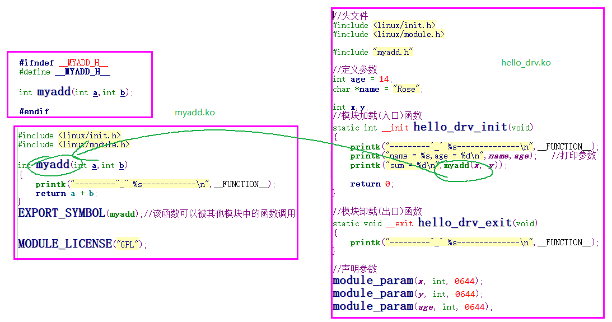

#### 一，linux内核模块

##### 1  模块组成

```c
//头文件
#include <linux/init.h>
#include <linux/module.h>


//模块加载(入口)函数
static int __init hello_drv_init(void)
{
        printk("---------^_^ %s--------------\n",__FUNCTION__);
        return 0;
}

//模块卸载(出口)函数
static void __exit hello_drv_exit(void)
{
        printk("---------^_^ %s--------------\n",__FUNCTION__);
}

//声明与认证
module_init(hello_drv_init);
module_exit(hello_drv_exit);
MODULE_LICENSE("GPL");

```

##### 2 模块编译

###### 2.1 编写Makefile文件

```makefile
#指定内核路径
KERN_DIR = /home/farsight/mp157/kernel/linux-stm32mp-5.4.31-r0/linux-5.4.31
#指定模块所在路径
CUR_DIR = `pwd`


all:
        make -C $(KERN_DIR) M=$(CUR_DIR) modules   #编译内核模块
clean:
        make -C $(KERN_DIR) M=$(CUR_DIR) clean   #删除生成的所有文件


#指定要编译的具体模块名称
obj-m += hello_drv.o

```

###### 2.2 编译内核模块

```sh
farsight@ubuntu:~/mp157/driver/day02_code/module_v1$ make
make -C /home/farsight/mp157/kernel/linux-stm32mp-5.4.31-r0/linux-5.4.31 M=`pwd` modules   #编译内核模块
make[1]: Entering directory '/home/farsight/mp157/kernel/linux-stm32mp-5.4.31-r0/linux-5.4.31'
  CC [M]  /home/farsight/mp157/driver/day02_code/module_v1/hello_drv.o
  Building modules, stage 2.
  MODPOST 1 modules
  CC [M]  /home/farsight/mp157/driver/day02_code/module_v1/hello_drv.mod.o
  LD [M]  /home/farsight/mp157/driver/day02_code/module_v1/hello_drv.ko
make[1]: Leaving directory '/home/farsight/mp157/kernel/linux-stm32mp-5.4.31-r0/linux-5.4.31'
```

##### 3，在开发板中测试内核模块

###### 3.1 将编译好的KO文件拷贝到文件系统中

```sh
mkdir  /opt/rootfs/drv_modules        //在文件系统目录下创建一个保持ko文件的目录,以后所有的驱动都可以放到此处
cp  *.ko   /opt/rootfs/drv_modules/
```

###### 3.2 在开发板的命令行加载模块到系统中

```sh
[root@fsmp1a drv_modules]# insmod hello_drv.ko      //加载模块
[10327.293051] hello_drv: loading out-of-tree module taints kernel.
[10327.297828] hello_drv: module verification failed: signature and/or required key missing - tainting kernel
[10327.307755] ---------^_^ hello_drv_init--------------   //当加载模块时，会执行模块加载函数


//查看被加载的模块
[root@fsmp1a drv_modules]# lsmod
Module                  Size  Used by    Tainted: G
hello_drv              16384  0

//卸载被加载的模块
[root@fsmp1a drv_modules]# rmmod hello_drv.ko       //卸载模块
[10571.793067] ---------^_^ hello_drv_exit--------------    //当卸载模块时，会执行模块卸载函数
```

##### 4,驱动开发工具----source insight

```
使用soruce insight 开发驱动，必须要在source insig中创建linux内核源码工程
1》将linux内核源码拷贝到windows中
2》打开source insight 创建工程
3》将linux内核源码文件加入工程中
4》同步工程文件
```

##### 5，模块的特点

###### 5.1 模块传参

```c
在insmod模块时，可以给模块传递参数
例如： 
//头文件
#include <linux/init.h>
#include <linux/module.h>

//定义参数
int age;
char *name;

//模块加载(入口)函数
static int __init hello_drv_init(void)
{
	printk("---------^_^ %s--------------\n",__FUNCTION__);
	printk("name = %s,age = %d\n",name,age);   //打印参数
	return 0;
}

//模块卸载(出口)函数
static void __exit hello_drv_exit(void)
{
	printk("---------^_^ %s--------------\n",__FUNCTION__);
}

//声明参数
module_param(age, int, 0644);
module_param(name, charp, 0644);


//声明与认证
module_init(hello_drv_init);
module_exit(hello_drv_exit);

```
```sh
//编译，并在开发板中测试
[root@fsmp1a drv_modules]# insmod hello_drv.ko age=18 name="peter"  //加载模块时，可以传递参数给模块
[14651.791186] ---------^_^ hello_drv_init--------------
[14651.794782] name = peter,age = 18

[root@fsmp1a drv_modules]# ls /sys/module/hello_drv/parameters/     //模块中的参数会在该目录下创建同名的文件
age   name
[root@fsmp1a drv_modules]# cat /sys/module/hello_drv/parameters/age  //文件中保持参数的值
18
[root@fsmp1a drv_modules]# cat /sys/module/hello_drv/parameters/name  //文件中保持参数的值
peter
```

###### 5.2 模块调用



```sh
//在开发板中加载模块
[root@fsmp1a drv_modules]# insmod myadd.ko                   //先加载被调用模块
[root@fsmp1a drv_modules]# insmod hello_drv.ko x=12 y=45	//然后加载调用模块
[15862.389999] ---------^_^ hello_drv_init--------------
[15862.393596] name = Rose,age = 14
[15862.396868] ---------^_^ myadd------------
[15862.400901] sum = 57
[root@fsmp1a drv_modules]# ls /sys/module/hello_drv/parameters/
age   name  x     y

```

#### 二，完整的驱动组成

##### 1，申请设备号

```c
static inline int register_chrdev(unsigned int major, const char *name, const struct file_operations *fops)
//参数1 ---- major：主设备号
			major >  0   ，表示静态指定主设备号
			major =  0   ，表示动态分配主设备，register_chrdev会返回主设备号
//参数2 ---- name：字符串，驱动描述信息，自定义
//参数3 ---- 结构体指针：struct file_operations
			struct file_operations {
                struct module *owner;
                    loff_t (*llseek) (struct file *, loff_t, int);
                    ssize_t (*read) (struct file *, char __user *, size_t, loff_t *);
                    ssize_t (*write) (struct file *, const char __user *, size_t, loff_t *);
                    ssize_t (*read_iter) (struct kiocb *, struct iov_iter *);
                    ssize_t (*write_iter) (struct kiocb *, struct iov_iter *);
                    int (*mmap) (struct file *, struct vm_area_struct *);
                }
//返回值------成功：如果major>0,返回0，如果major=0,返回主设备号,失败：错误码

例如：
#if 0
	//静态指定
	ret = register_chrdev(led_major,"led_drv", &led_fops);
	if(ret<0){
		printk("register_chrdev error\n");
		return -EINVAL;
	}
#else
	//动态分配
	led_major = register_chrdev(0,"led_drv", &led_fops);
	if(led_major<0){
		printk("register_chrdev error\n");
		return -EINVAL;
	}
#endif 
```
```sh
//在开发板中测试
[root@HQYJ drv_modules]# insmod led_drv.ko
[17450.363146] -----------^_^ led_drv_init-------------
[root@HQYJ drv_modules]# cat /proc/devices
Character devices:
128 ptm
136 pts
153 spi
166 ttyACM
180 usb
189 usb_device
226 drm
241 led_drv
242 rpmb
243 ttyGS
244 ttyUSI
245 ttySTM
246 bsg
247 watchdog
248 tee
249 iio
250 ptp
251 pps
252 cec

```

##### 2,  创建设备结点

###### 2.1 手动创建

```sh
	mknod [OPTION]... NAME TYPE [MAJOR MINOR]
	例如：
		[root@fsmp1a drv_modules]# mknod /dev/hello c 241 7
        [root@fsmp1a drv_modules]# ls -l /dev/hello
        crw-r--r--    1 root     root      241,   7 Jan  3 02:37 /dev/hello
```

###### 2.2 在驱动中创建

```c
struct device *device_create(struct class *class, struct device *parent,
			     dev_t devt, void *drvdata, const char *fmt, ...)
	//参数1 ---- 结构体指针 ：struct class
	//参数2 ---- 父节点，一般为:NULL
	//参数3 ---- 设备号：32位的整数，由主设备号和次设备号组成
				主设备号：占高12位，表示一类设备
				次设备号：占低20位，表示具体的设备编号  
				#define MAJOR(dev)	((unsigned int) ((dev) >> MINORBITS))   //从设备号中获取主设备号
                #define MINOR(dev)	((unsigned int) ((dev) & MINORMASK))    //从设备号中获取次设备号
                #define MKDEV(ma,mi)	(((ma) << MINORBITS) | (mi))		//将主次设备号转为设备号
   //参数4 ----- 私有数据，一般为：NULL
   //参数5 ----- 设备节点名称
   //变参 ------配合参数5定义设备节点名称
   //返回值 ---成功：返回结构体struct device的指针，失败:NULL
   
  struct class * class_create(struct module *owner, const char *name)
  //参数1 ---- 当前模块，一般为：THIS_MODULE
  //参数2 ---- 字符串，描述信息，自定义
  //返回值 ---- 成功：结构体指针struct class *  ，失败：NULL
  
  例如： 
  //创建类
	led_clz = class_create(THIS_MODULE, "led_class");
	if(!led_clz){
		printk("class_create error\n");
		ret = PTR_ERR(led_clz);
		goto err_unregister_chrdev;
	}

	//2,创建设备结点
	led_dev = device_create(led_clz, NULL, MKDEV(led_major, 5), NULL, "led%d",2);
	if(!led_dev){
		printk("device_create error\n");
		ret = PTR_ERR(led_dev);
		goto err_class_destr;
	}
```
```sh
//在开发板中测试：
	[root@HQYJ drv_modules]# insmod led_drv.ko
    [20104.412653] -----------^_^ led_drv_init-------------
    [root@HQYJ drv_modules]# ls -l /dev/led*
    crw-------    1 root     root      241,   5 Jan  1 23:51 /dev/led2

```

##### 3, 硬件初始化

```c
驱动开发思路：看原理图---->看芯片手册--->硬件初始化(地址映射/中断申请) ----->实现操作接口

static inline void __iomem *ioremap(phys_addr_t offset, size_t size)
//参数1 ----- 物理地址
//参数2 ----- 要映射的空间大小
//返回值 ---- 成功：虚拟空间的地址，失败：NULL
例如：
#if 0
	gpioz_mode =  ioremap(GPIOZ, 4);
	gpioz_odr  =   ioremap(GPIOZ+0x14,4);
   #else
   	gpioz_mode = ioremap(GPIOZ,24);    
	if(!gpioz_mode){
			printk("ioremap error\n");
			ret = PTR_ERR(gpioz_mode);
			goto err_device_destr;
		}
   	gpioz_odr  = gpioz_mode + 5;
   #endif 
```

##### 4，实现操作接口

```c
int led_drv_open(struct inode *inode, struct file *filp)
{
	int i;
	printk("-----------^_^ %s-------------\n",__FUNCTION__);
	//将gpio设置为输出模式
	*gpioz_mode &=  ~(0x3f<<10);
	*gpioz_mode |= 0x15 << 10;

	//让led闪烁
	for(i = 0; i < 4; i++){
		*gpioz_odr |= 0x7 << 5;
		 msleep(500);
		*gpioz_odr &= ~(0x7 << 5);
		 msleep(500);
	}

	return 0;
}

const struct file_operations led_fops = {
	.open	=	led_drv_open,
};
```

#### 三，应用与驱动之间传递数据

##### 1，应用数据传给内核 ------实现write时使用

```c
static unsigned long copy_from_user(void *to, const void __user *from, unsigned long n)
//参数1 --- 内核空间地址
//参数2 --- 应用数据的空间地址
//参数3 --- 数据长度
//返回值 ---- 成功：0，失败：返回为copy的数据
例如：
ssize_t led_drv_write(struct file *filp, const char __user *buf, size_t size, loff_t *flags)
{
	int ret;
	int value;
	printk("-----------^_^ %s-------------\n",__FUNCTION__);
	//将应用数据转为内核数据
	ret = copy_from_user(&value, buf, size);
	if(ret > 0){
		printk("copy_from_user error\n");
		return -EINVAL;
	}

	//判断应用传递的数据 1---开灯，0 --- 关灯
	if(value){
		//开灯
		*gpioz_odr |= 0x7 << 5;
	}else{
		//关灯
		*gpioz_odr &= ~(0x7 << 5);
	}

	return size;
}
```


##### 2，内核数据传给应用   -----实现read时使用

```c
static inline int copy_to_user(void __user volatile *to, const void *from, unsigned long n)
//参数1 --- 应用空间地址
//参数2 --- 内核数据的空间地址
//参数3 --- 数据长度
//返回值 ---- 成功：0，失败：返回为copy的数据
```

