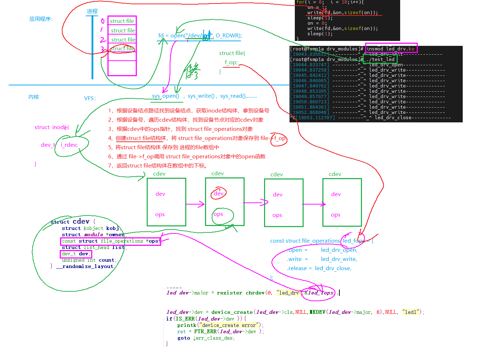

#### 一，面向对象编程

```C
static inline void *kzalloc(size_t size, gfp_t gfp)  //申请物理空间连续，且被初始化的一块内存空间
//参数1 ----- 要申请的空间大小
//参数2 ----- 标志位:GFP_KERNEL
//返回值 ----成功：申请到的空间地址，失败：NULL
例如： 
//设计设备对象类型
struct mp157_led{
	unsigned int major;
	struct class *  clz;
	struct device * dev;

	unsigned int * mode;
	unsigned int * odr;
};

struct mp157_led  *led_dev;

// 0，实例化全局设备对象
led_dev = kzalloc(sizeof(*led_dev), GFP_KERNEL);
if(!led_dev){
		printk("kzalloc error");
		return -ENOMEM;
}
```

#### 二，应用调用驱动过程分析

##### 1，了解内核中相关的几个结构体

```c
1》struct file -------//进程打开文件时，被动态创建
    struct file {
        union {
            struct llist_node	fu_llist;
            struct rcu_head 	fu_rcuhead;
        } f_u;
        struct path		f_path;
        struct inode		*f_inode;	/* cached value */
        const struct file_operations	*f_op;

        /*
         * Protects f_ep_links, f_flags.
         * Must not be taken from IRQ context.
         */
        spinlock_t		f_lock;
        enum rw_hint		f_write_hint;
        atomic_long_t		f_count;
        unsigned int 		f_flags;
        fmode_t			f_mode;
        struct mutex		f_pos_lock;
        loff_t			f_pos;
        struct fown_struct	f_owner;
        const struct cred	*f_cred;
        struct file_ra_state	f_ra;
        u64			f_version;

        void			*private_data;


        struct address_space	*f_mapping;
        errseq_t		f_wb_err;
    }
2》 struct inode ----描述文件属性信息，当创建文件时，同时会在内核中创建该结构体
	struct inode {
        umode_t			i_mode;
        unsigned short		i_opflags;
        kuid_t			i_uid;
        kgid_t			i_gid;
        unsigned int		i_flags;

        const struct inode_operations	*i_op;
        struct super_block	*i_sb;
        struct address_space	*i_mapping;


        /* Stat data, not accessed from path walking */
        unsigned long		i_ino;

        union {
            const unsigned int i_nlink;
            unsigned int __i_nlink;
        };
        dev_t			i_rdev;
        loff_t			i_size;
        struct timespec64	i_atime;
        struct timespec64	i_mtime;
        struct timespec64	i_ctime;
        spinlock_t		i_lock;	/* i_blocks, i_bytes, maybe i_size */
        unsigned short          i_bytes;
        u8			i_blkbits;
        u8			i_write_hint;
        blkcnt_t		i_blocks;


        /* Misc */
        unsigned long		i_state;
        struct rw_semaphore	i_rwsem;

        unsigned long		dirtied_when;	/* jiffies of first dirtying */
        unsigned long		dirtied_time_when;

        struct hlist_node	i_hash;
        struct list_head	i_io_list;	/* backing dev IO list */

        struct list_head	i_lru;		/* inode LRU list */
        struct list_head	i_sb_list;
        struct list_head	i_wb_list;	/* backing dev writeback list */
        union {
            struct hlist_head	i_dentry;
            struct rcu_head		i_rcu;
        };
        atomic64_t		i_version;
        atomic64_t		i_sequence; /* see futex */
        atomic_t		i_count;
        atomic_t		i_dio_count;
        atomic_t		i_writecount;

        union {
            const struct file_operations	*i_fop;	/* former ->i_op->default_file_ops */
            void (*free_inode)(struct inode *);
        };
        struct file_lock_context	*i_flctx;
        struct address_space	i_data;
        struct list_head	i_devices;
        union {
            struct pipe_inode_info	*i_pipe;
            struct block_device	*i_bdev;
            struct cdev		*i_cdev;
            char			*i_link;
            unsigned		i_dir_seq;
        };
        __u32			i_generation;
        void			*i_private; /* fs or device private pointer */
    };
    
3》struct cdev -------//申请设备号时，被创建,用于管理驱动
	struct cdev {
        struct kobject kobj;
        struct module *owner;
        const struct file_operations *ops;
        struct list_head list;
        dev_t dev;
        unsigned int count;
    } __randomize_layout;
    
4》	设备操作对象类型 ------在驱动程序中需要实现的结构体
	struct file_operations {
        struct module *owner;
        loff_t (*llseek) (struct file *, loff_t, int);
        ssize_t (*read) (struct file *, char __user *, size_t, loff_t *);
        ssize_t (*write) (struct file *, const char __user *, size_t, loff_t *);
        ssize_t (*read_iter) (struct kiocb *, struct iov_iter *);
        ssize_t (*write_iter) (struct kiocb *, struct iov_iter *);
        int (*iopoll)(struct kiocb *kiocb, bool spin);
        int (*iterate) (struct file *, struct dir_context *);
        int (*iterate_shared) (struct file *, struct dir_context *);
        __poll_t (*poll) (struct file *, struct poll_table_struct *);
        long (*unlocked_ioctl) (struct file *, unsigned int, unsigned long);
        long (*compat_ioctl) (struct file *, unsigned int, unsigned long);
        int (*mmap) (struct file *, struct vm_area_struct *);
        unsigned long mmap_supported_flags;
        int (*open) (struct inode *, struct file *);
        int (*flush) (struct file *, fl_owner_t id);
        int (*release) (struct inode *, struct file *);
        int (*fsync) (struct file *, loff_t, loff_t, int datasync);
        int (*fasync) (int, struct file *, int);
      }
```

##### 2, 应用调用驱动过程



#### 三，杂项设备

##### 1，杂项设备对象类型

```c
项设备也是在嵌入式系统中用得比较多的一种设备驱动。
在 Linux 内核的include/linux目录下有Miscdevice.h文件，要把自己定义的misc device从设备定义在这里。
其实是因为这些字符设备不符合预先确定的字符设备范畴， 所有这些设备采用主设备号为10 ，一起归于misc device，其实misc_register就是用主设备号10调用register_chrdev()的。
也就是说，杂项设备其实也就是特殊的字符设备，可自动生成设备节点。

struct miscdevice  {
	int minor;          //次设备号
	const char *name;      //设备结点名称
	const struct file_operations *fops;  //指向设备操作对象的指针
	struct list_head list;
	struct device *parent;       //父类
	struct device *this_device;
	const struct attribute_group **groups;
	const char *nodename;
	umode_t mode;
};

```

##### 2，杂项设备对象注册和注销

```c
extern int misc_register(struct miscdevice *misc);
//当调用注册函数时，内核申请设备号，并创建设备结点

extern void misc_deregister(struct miscdevice *misc);
```

##### 3，杂项设备驱动实例---led驱动

```c
//全局设备对象类型
struct mp157_led{
	struct miscdevice  misc;   //定义杂项设备对象
	unsigned int * mode;
	unsigned int * odr;
};

struct mp157_led  *led_dev;

static int __init led_drv_init(void)
{
	int ret;
	printk("-----------^_^ %s-------------\n",__FUNCTION__);
	//1，申请全局设备对象空间 ---同时分配杂项设备对象空间 
	led_dev = kzalloc(sizeof(*led_dev), GFP_KERNEL);
	if(!led_dev){
		printk("kzalloc error");
		return -ENOMEM;
	}
	//2,初始化杂项设备对象
	led_dev->misc.fops  =  &led_fops;  //设备操作对象地址
	led_dev->misc.minor = 7;          //次设备号
	led_dev->misc.name =  "led01";    //设备结点名称

	//3,注册杂项设备对象
	ret = misc_register(&led_dev->misc);
	if(ret < 0){
		printk("misc_register error\n");
		goto err_kfree;
	}
	//4,硬件初始化
   	led_dev->mode = ioremap(GPIOZ,24);    
	if(!led_dev->mode){
			printk("ioremap error\n");
			ret = PTR_ERR(led_dev->mode);
			goto err_misc_deregister;
		}
   	led_dev->odr  = led_dev->mode + 5;

	return 0;
err_misc_deregister:
	misc_deregister(&led_dev->misc);
err_kfree:
	kfree(led_dev);
	return ret;

}
```

#### 四，iotcl的实现

```c
应用层：
	#include <sys/ioctl.h>
    int ioctl(int fd, unsigned long request, ...);
    //参数1  ---- 文件描述符
    //参数2  ---- 请求
    //变参   ---- 根据参数2决定变参的类型和个数
  ----------------------------------------------------
 内核驱动：
 	long xxx_ioctl(struct file *filp, unsigned int cmd, unsigned long arg)
 	{
 			switch(cmd){
 				case 常量1:
 					break;
 				case 常量2:
 					break;
 					....
 			}
 	}
  cmd为应用层传递的命令，在驱动中需要定义命令，一般有两种方法：
  方法一：直接用整数定义命令
  	#define LED_ALL_ON    0x1234
	#define LED_ALL_OFF   0x5678
  方法二：用内核提供的算法
  	#define _IO(type,nr)		
    #define _IOR(type,nr,size)	
    #define _IOW(type,nr,size)	
    //参数1 ----表示设备标志
    //参数2 ----命令编号
    //参数3 ----ioctl的第三个参数的类型
    
  例如： 
  long led_drv_ioctl(struct file *filp, unsigned int cmd, unsigned long args)
{
	int shift = args + 4;
	printk("-----------^_^ %s-------------\n",__FUNCTION__);

	switch(cmd){
		case LED_ALL_ON:
			*led_dev->odr |= 0x7 << 5;
			break;
		case LED_ALL_OFF:
			*led_dev->odr &= ~(0x7 << 5);
			break;
		case LED_NUM_ON:
			if(args != 1 && args !=2 && args != 3)
				return -EAGAIN;
			else
				*led_dev->odr |= 0x1 << shift;
			break;
		case LED_NUM_OFF:
			if(args != 1 && args !=2 && args != 3)
				return -EAGAIN;
			else
				*led_dev->odr &= ~(0x1 << shift);
			break;
		default:
			printk("unknow cmd\n");
			return -EINVAL;
	}

	return 0;
}
```

#### 五，操作寄存器的方式

##### 1，通过直接位运算

```c
//将gpio设置为输出模式
*led_dev->mode &=  ~(0x3f<<10);
*led_dev->mode  |= 0x15 << 10;
```

##### 2，内核提供的函数

```c
//向指定的内存地址写数据(寄存器映射的虚拟地址)
static inline void writeb(u8 value, volatile void __iomem *addr)  //写1一个字节数据
static inline void writew(u16 value, volatile void __iomem *addr) //写2一个字节数据
static inline void writel(u32 value, volatile void __iomem *addr) //写4一个字节数据
static inline void writeq(u64 value, volatile void __iomem *addr) //写8一个字节数据

//从指定内存中读数据(寄存器映射的虚拟地址)
static inline u8 readb(const volatile void __iomem *addr)   //读1一个字节数据
static inline u16 readw(const volatile void __iomem *addr)  //读2一个字节数据
static inline u32 readl(const volatile void __iomem *addr)  //读4一个字节数据
static inline u64 readq(const volatile void __iomem *addr)  //读8一个字节数据

例如： 
int led_drv_open(struct inode *inode, struct file *filp)
{
	u32 value;
	printk("-----------^_^ %s-------------\n",__FUNCTION__);
	//将gpio设置为输出模式
	value = readl(led_dev->mode);
	value &=  ~(0x3f<<10);
	value |= 0x15 << 10;
	writel(value, led_dev->mode);
	return 0;
}
ssize_t led_drv_write(struct file *filp, const char __user *buf, size_t size, loff_t *flags)
{
	int ret;
	int value;
	printk("-----------^_^ %s-------------\n",__FUNCTION__);
	//将应用数据转为内核数据
	ret = copy_from_user(&value, buf, size);
	if(ret > 0){
		printk("copy_from_user error\n");
		return -EINVAL;
	}

	//判断应用传递的数据 1---开灯，0 --- 关灯
	if(value){
		//开灯
		//*led_dev->odr |= 0x7 << 5;
		writel(readl(led_dev->odr) |0x7 << 5,led_dev->odr);
	}else{
		//关灯
		//*led_dev->odr &= ~(0x7 << 5);
		writel(readl(led_dev->odr)  & ~(0x7 << 5),led_dev->odr);
	}

	return size;
}
```

