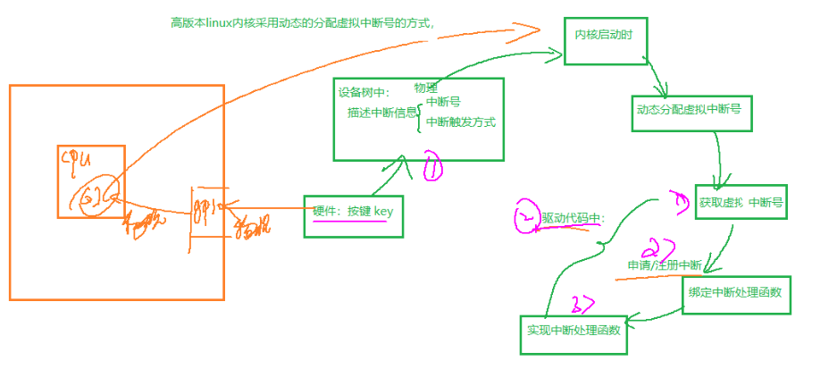

#### 一，pinctl子系统和gpio子系统的使用

##### 1，pinctl子系统

```
pinctl子系统 -----设置引脚的复用和电气属性。
传统的对引脚复用和电气属性设置都是直接对寄存器操作，完成IO的初始化，这种方法很繁琐，而且容易出问题（比如pin功能冲突）。在Linux系统中使用这种繁琐的操作不现实，所以就有了pinctl子系统。
（简单的说就是不用自己去设置引脚复用和电气属性了，只要在设备树中添加相应的节点并描述，pinctrl系统就会帮我们设置（它是内核中的一段程序））

pinctrl 子系统会干这些事：

获取设备树中pin信息。
根据获取到的pin信息来设置引脚复用。
根据获取到的pin信息来设置电气属性（比如上/下拉、速度、驱动能力等）。
对于使用者来讲，只需要在设备树里面设置好某个 io 的相关属性即可，其他的初始化工作均由 pinctrl 子系统来完成， pinctrl 子系统源码目录为 drivers/pinctrl。

要想使用pinctl，那么就需要在设备树中对pin的信息描述，pinctl子系统根据描述信息来配置pin的功能，一般会在设备树下为一组 io （通常是某一个外设上使用的所有io在一个节点中配置）创建一个节点来描述
	stm32mp151.dtsi：
			pinctrl: pin-controller@50002000 {
                        #address-cells = <1>;
                        #size-cells = <1>;
                        compatible = "st,stm32mp157-pinctrl";
                        ranges = <0 0x50002000 0xa400>;
                        interrupt-parent = <&exti>;
                        st,syscfg = <&exti 0x60 0xff>;
                        hwlocks = <&hsem 0 1>;
                        pins-are-numbered;

                        gpioa: gpio@50002000 {
                                gpio-controller;		//表示当前节点可以作为gpio控制器，管理多个gpio引脚
                                #gpio-cells = <2>;		//子节点描述gpio引脚时，必须用2个32整数
                                interrupt-controller;
                                #interrupt-cells = <2>;
                                reg = <0x0 0x400>;
                                clocks = <&rcc GPIOA>;
                                st,bank-name = "GPIOA";
                                status = "disabled";
                        };
				。。。。
				}
	stm32mp15xx-fsmp1x.dtsi		
		&pinctrl {
			// 在pinctrl节点中加入wifi的引脚的复用功能的配置信息
            sdmmc3_b4_wifi_pins_a: sdmmc3-b4-wifi-0 {
                pins1 {
                        pinmux = <STM32_PINMUX('F', 0, AF9)>, /* SDMMC3_D0 */
                        <STM32_PINMUX('F', 4, AF9)>, /* SDMMC3_D1 */
                        <STM32_PINMUX('D', 5, AF10)>, /* SDMMC3_D2 */
                        <STM32_PINMUX('D', 7, AF10)>, /* SDMMC3_D3 */
                        <STM32_PINMUX('D', 0, AF10)>; /* SDMMC3_CMD */
                        slew-rate = <1>;
                        drive-push-pull;
                        bias-pull-up;
                };
            }
             sdmmc3_b4_od_wifi_pins_a: sdmmc3-b4-od-wifi-0 {
                    pins1 {
                            pinmux = <STM32_PINMUX('F', 0, AF9)>, /* SDMMC3_D0 */
                            <STM32_PINMUX('F', 4, AF9)>, /* SDMMC3_D1 */
                            <STM32_PINMUX('D', 5, AF10)>, /* SDMMC3_D2 */
                            <STM32_PINMUX('D', 7, AF10)>; /* SDMMC3_D3 */
                            slew-rate = <1>;
                            drive-push-pull;
                            bias-pull-up;
                    };
			}
			sdmmc3_b4_sleep_wifi_pins_a: sdmmc3-b4-sleep-wifi-0 {
                pins {
                        pinmux = <STM32_PINMUX('F', 0, ANALOG)>, /* SDMMC3_D0 */
                        <STM32_PINMUX('F', 4, ANALOG)>, /* SDMMC3_D1 */
                        <STM32_PINMUX('D', 5, ANALOG)>, /* SDMMC3_D2 */
                        <STM32_PINMUX('D', 7, ANALOG)>, /* SDMMC3_D3 */
                        <STM32_PINMUX('G', 15, ANALOG)>, /* SDMMC3_CK */
                        <STM32_PINMUX('D', 0, ANALOG)>; /* SDMMC3_CMD */
                };
			}

          };
	//设备节点中使用配置好的pin的功能
	&sdmmc3 {
        arm,primecell-periphid = <0x10153180>;
        pinctrl-names = "default", "opendrain", "sleep";
        pinctrl-0 = <&sdmmc3_b4_wifi_pins_a>;
        pinctrl-1 = <&sdmmc3_b4_od_wifi_pins_a>;
        pinctrl-2 = <&sdmmc3_b4_sleep_wifi_pins_a>;
       。。。。
    };
```


##### 2，gpio子系统

```
当在pinctrl中将引脚的复用功能设置为gpio功能时，此时可以使用gpio子系统
gpio 子系统顾名思义，就是用于初始化 GPIO 并且提供相应的 API 函数
gpio 子系统的主要目的就是方便驱动开发者使用 gpio，驱动开发者在设备树中添加 gpio 相关信息，然后就可以在驱动程序中使用 gpio 子系统提供的 API函数来操作 GPIO ， Linux 内核向驱动开发者屏蔽掉了 GPIO 的设置过程，极大的方便了驱动开发者使用 GPIO

 	ov5640: camera@3c {
        compatible = "ovti,ov5640";
        reg = <0x3c>;
        clocks = <&clk_ext_camera>;
        clock-names = "xclk";
        DOVDD-supply = <&v2v8>;
        powerdown-gpios = <&gpioa 4 (GPIO_ACTIVE_HIGH | GPIO_PUSH_PULL)>; //引脚pinctrl中的gpio的复用功能
        reset-gpios = <&gpioa 3 (GPIO_ACTIVE_LOW | GPIO_PUSH_PULL)>;	//引脚pinctrl中的gpio的复用功能
   		用两个32位整数描述gpio，第一个参数表示具体的引脚编号，第二个参数表示初始电平
   		/* Bit 0 express polarity */
        #define GPIO_ACTIVE_HIGH 0
        #define GPIO_ACTIVE_LOW 1
  
在驱动中，内核gpio子系统中提供相关操作gpio的函数，通过这些函数可以获取gpio信息，进而对gpio进行操作

//旧版的gpio子系统函数
static inline int gpio_request(unsigned gpio, const char *label)   //获取gpio引脚使用权
static inline void gpio_free(unsigned gpio)            //释放gpio引脚使用权
static inline int gpio_direction_input(unsigned gpio)  //将gpio设置为输入
static inline int gpio_direction_output(unsigned gpio, int value)  //将gpio设置为输出，同时输出高低电平
static inline int gpio_get_value(unsigned gpio)         //获取gpio引脚的数据
static inline void gpio_set_value(unsigned gpio, int value)  //设置gpio引脚的数据

//新版的gpio子系统函数
struct gpio_desc *gpiod_get(struct device *dev,const char *con_id, enum gpiod_flags flags)//获取gpio引脚对象指针
static inline void gpiod_put(struct gpio_desc *desc)      //释放gpio引脚对象
int gpiod_direction_input(struct gpio_desc *desc);      //将gpio设置为输入
int gpiod_direction_output(struct gpio_desc *desc, int value);	  //将gpio设置为输出，同时输出高低电平
int gpiod_get_value(const struct gpio_desc *desc);     //获取gpio引脚的数据
void gpiod_set_value(struct gpio_desc *desc, int value);  //设置gpio引脚的数据

//获取gpio引脚对象指针
struct gpio_desc *devm_gpiod_get(struct device *dev,  const char *con_id,enum gpiod_flags flags);
void devm_gpiod_put(struct device *dev, struct gpio_desc *desc);  //释放gpio引脚对象
```

##### 3，使用gpio子系统实现led驱动

###### 3.1，gpio方式一 (旧版gpio函数)

```
1 设备树节点定义
    led_test2@0x54004000{
        compatible = "stm32mp157,led2";
        gpios = <&gpioz 5 0>, <&gpioz 6 0> , <&gpioz 7 0>;
        //gpios = <&gpioz 5 0 &gpioz 6 0 &gpioz 7 0>;
        //gpios = <&gpioz 5 GPIO_ACTIVE_HIGH &gpioz 6 GPIO_ACTIVE_HIGH &gpioz 7 GPIO_ACTIVE_HIGH>;
        dev_name = "led01";
        dev_minor = <19>;
    };

2 驱动代码
	// 1,获取自定义数据
	 np = pdev->dev.of_node;    
	of_property_read_string(np, "dev_name", (const char * *)&dev_name);
	of_property_read_u32(np, "dev_minor", &minor);


	// 2,获取led对应的gpio接口
	led_dev->gpioz_5 = of_get_gpio(np, 0);  //获取设备树种结点属性gpios中的某个gpio编号
	if(led_dev->gpioz_5 < 0){
        ret = led_dev->gpioz_5;
        printk("of_get_gpio error");
        goto err_kfree;
    }
	led_dev->gpioz_6 = of_get_gpio(np, 1);
	if(led_dev->gpioz_6< 0){
        ret = led_dev->gpioz_6;
        printk("of_get_gpio error");
        goto err_kfree;
    }
	led_dev->gpioz_7 = of_get_gpio(np, 2);
	if(led_dev->gpioz_7 < 0){
        ret = led_dev->gpioz_7;
        printk("of_get_gpio error");
        goto err_kfree;
    }
	
	//实现操作函数
	ssize_t led_drv_write(struct file *filp, const char __user * buf, size_t size, loff_t *flags)
    {
        int ret;
        int value;
        printk("--------^_^ %s------------\n",__FUNCTION__);
        // 1,用户数据转为内核数据
        ret = copy_from_user(&value, buf, size);
        if(ret > 0){
            printk("copy_from_user error");
            return -EAGAIN;
        }
        //根据传递的数据，开灯或灭灯
        if(value){
            gpio_request(led_dev->gpioz_5, "gpioz_5");
            gpio_direction_output(led_dev->gpioz_5, 1);
            gpio_free(led_dev->gpioz_5);

            gpio_request(led_dev->gpioz_6, "gpioz_6");
            gpio_direction_output(led_dev->gpioz_6, 1);
            gpio_free(led_dev->gpioz_6);

            gpio_request(led_dev->gpioz_7, "gpioz_7");
            gpio_direction_output(led_dev->gpioz_7, 1);
            gpio_free(led_dev->gpioz_7);
        }else{
            gpio_request(led_dev->gpioz_5, "gpioz_5");
            gpio_direction_output(led_dev->gpioz_5, 0);
            gpio_free(led_dev->gpioz_5);

            gpio_request(led_dev->gpioz_6, "gpioz_6");
            gpio_direction_output(led_dev->gpioz_6, 0);
            gpio_free(led_dev->gpioz_6);

            gpio_request(led_dev->gpioz_7, "gpioz_7");
            gpio_direction_output(led_dev->gpioz_7, 0);
            gpio_free(led_dev->gpioz_7);
        }
        return size;
    }
```

###### 3.2  gpio方式二(新版gpio函数)

```
 1 设备树节点定义
    led_test3@0x54004000{
            compatible = "stm32mp157,led3";
            //led-gpios = <&gpioz 5 0>, <&gpioz 6 0> , <&gpioz 7 0>;
            //led-gpios = <&gpioz 5 0 &gpioz 6 0 &gpioz 7 0>;
            led-gpios = <&gpioz 5 GPIO_ACTIVE_HIGH>,<&gpioz 6 GPIO_ACTIVE_HIGH>, <&gpioz 7 GPIO_ACTIVE_HIGH>;
            dev_name = "led01";
            dev_minor = <19>;
        };

    
2.驱动代码中获取gpio
	//定义of_match_table
	const struct of_device_id	led_of_match_table[] = {
        {.compatible = "stm32mp157,led3"},
    };
    
    //brobe函数中
    struct device_node *np = pdev->dev.of_node;
    //获取自定义数据
	of_property_read_string(np, "dev_name", (const char * *)&dev_name);
	of_property_read_u32(np, "dev_minor", &minor);
	
	#if 0
        //获取设备树种gpio的编号 --//旧的gpio方式
        led_dev->gpioz_5 = of_get_gpio(np, 0);
        led_dev->gpioz_6 = of_get_gpio(np, 1);
        led_dev->gpioz_7 = of_get_gpio(np, 2);
    #else
        //获取设备树种gpio的编号 --//新的gpio方式
        //参数 led 表示在设备树中，gpio对应的属性名的前缀，应该为led-gpios
        led_dev->gpioz_5 = devm_gpiod_get_index(&pdev->dev, "led", 0,GPIOD_OUT_HIGH);
        led_dev->gpioz_6 = devm_gpiod_get_index(&pdev->dev, "led", 1,GPIOD_OUT_HIGH);
        led_dev->gpioz_7 = devm_gpiod_get_index(&pdev->dev, "led", 2,GPIOD_OUT_HIGH);

    #endif 
   
    //实现操作函数接口
    ssize_t led_drv_write(struct file *filp, const char __user *buf, size_t size, loff_t *flags)
    {
        int value,ret;
         printk("--------^_^ %s---------\n",__FUNCTION__);

         //1，将用户数据转为内核数据
        ret =  copy_from_user(&value, buf, size);
        if(ret > 0){
            printk("copy_from_user error");
            return -EINVAL;
        }

         //2，根据传递的数据控制led
         if(value){   //开灯
                gpiod_direction_output(led_dev->gpioz_5, 1);  //将gpio引脚设置为输出模式，同时输出高电平
                gpiod_direction_output(led_dev->gpioz_6, 1);
                gpiod_direction_output(led_dev->gpioz_7, 1);
         }else{   //灭灯
                gpiod_direction_output(led_dev->gpioz_5, 0);  //将gpio引脚设置为输出模式，同时输出高电平
                gpiod_direction_output(led_dev->gpioz_6, 0);
                gpiod_direction_output(led_dev->gpioz_7, 0);
         }

         return size;
    }
```

#### 二，中断

##### 1，概念

```
首先需要了解一下中断的概念：为了提高CPU和外围硬件(硬盘，键盘，鼠标等等)之间协同工作的性能，引入了中断的机制。

没有中断的话，CPU和外围设备之间协同工作可能只有轮询这个方法：CPU定期检查硬件状态，需要处理时就处理，否则就跳过。

当硬件忙碌的时候，CPU很可能会做许多无用功（每次轮询都是跳过不处理）。中断机制是硬件在需要的时候向CPU发出信号，CPU暂时停止正在进行的工作，来处理硬件请求的一种机制。

一个“中断”仅仅是一个信号，当硬件需要获得处理器对它的关注时，就可以发送这个信号。内核维护了一个中断信号线的注册表，该注册表类似于I/O端口的注册表。

在处理器中，所谓中断，是一个过程，即 CPU 在正常执行程序的过程中，遇到外部／内部的紧急事件需要处理，暂时中断（中止）当前程序的执行，而转去为事件服务，待服务完毕，再返回到暂停处（断点）继续执行原来的程序。为事件服务的程序称为中断服务程序或中断处理程序。严格地说，上面的描述是针对硬件事件引起的中断而言的。用软件方法也可以引起中断，即事先在程序中安排特殊的指令，CPU 执行到该类指令时，转去执行相应的
一段预先安排好的程序，然后再返回来执行原来的程序，这可称为软中断。把软中断考虑进去，可给中断再下一个定义：中断是一个过程，是 CPU 在执行当前程序的过程中因硬件或软件的原因插入了另一段程序运行的过程。因硬件原因引起的中断过程的出现是不可预测的，即随机的，而软中断是事先安排的。

中断源的概念 
仔细研究一下生活中的中断，对于理解中断的概念也很有好处。什么可以引起中断，生活中很多事件可以引起中断： 
 有人按门铃了，电话铃响了，你的闹钟响了，你烧的水开了……诸如此类的事件。我们把可以引起中断的信号源称为中断源。
```



##### 2,设备树中描述中断信息

```
1》当某个设备要使用中断时，需要在设备树中描述中断信息：
	设备的中断源是哪个(物理中断号)，中断发送给哪个中断控制器
	
	所以在设备树节点中需要描述两个属性：
	interrupts     ------ //表示设备要使用哪个中断，中断的触发方法等
	interrupt-parent ---- //这个中断要挂在哪个设备上？中断控制器是谁
	或
	interrupts-extended = <&gpiof 9,IRQ_TYPE_EDGE_BOTH>;  //参数1-中断控制器，参数2-中断号，参数3-触发方式

2》上述两个属性的值如何确定
	interrupts ----用多少个u32位的整数表示应该由它的中断控制器结点来描述
	在中断控制器中，至少有两个属性：
	interrupt-controller;       //表示当前节点是个中断控制器
	#interrupt-cells             //表示子设备节点中应该有几个u32位整数来描述中断信息

最终在设备树中描述的中断信息被内核转换为platform_device中的中断资源，从中可以获取虚拟中断号	

3》设备树中中断信息处理
	
	中断控制器分为：root controller, gpio irq controller
	
	root controller  ---设备树和内核中芯片公司已做好
	
	gpio irq controller 
	设备树描述信息  ------pinctrl节点中
	驱动中   ------- 内核通过pinctl子系统来处理
	
	具体的设备中断
	设备树文件中的描述  ------该设备中断是哪个中断控制器的哪个中断，以及中断触发方式
	在驱动中 ----- 从platform_device中获取对应的中断资源，进而获取中断号	
```

##### 3，中断实例---以按键为例

###### 3.1 在设备树中添加结点

```
 key_test1{
        compatible = "stm32mp157,key_test1";
        dev-name = "key01";               //设备结点名称
        minor      =   <7>;
        interrupt-parent = <&gpiof>;
        interrupts = <7 IRQ_TYPE_EDGE_BOTH>;
    };
```

###### 3.2  驱动实现

```
1》申请中断
 int request_irq(unsigned int irq, irq_handler_t handler, unsigned long flags, const char *name, void *dev)
    //参数1 --中断号(虚拟中断号)
    //参数2 -- 中断处理函数：typedef irqreturn_t (*irq_handler_t)(int, void *);			 
    //参数3 --- 触发方式：
                #define IRQF_TRIGGER_RISING	0x00000001
                #define IRQF_TRIGGER_FALLING	0x00000002
                #define IRQF_TRIGGER_HIGH	0x00000004
                #define IRQF_TRIGGER_LOW	0x00000008
    //参数4 ---- 描述信息，自定义
    //参数5 ---- 传给中断处理函数的参数
    //返回值 ---- 成功：0，失败：错误码
   例如： 
   	ret = request_irq(key_dev->irqno, key_irq_fun, IRQF_TRIGGER_FALLING|IRQF_TRIGGER_RISING, "gpiof_7/key1", NULL);
	if(ret){
		printk("request_irq error");
		goto err_misc_deregister;
	}    
 2》实现中断处理函数
 	irqreturn_t xxx_irq_handler(int, void *)
 	{
 		//处理中断的过程
 	
 	}
 	例如：
 	irqreturn_t key_irq_fun(int irqno, void * dev_id)
    {
        int value;
        printk("-----------^_^ %s-------------\n",__FUNCTION__);
        return IRQ_HANDLED;
    }
 3》释放中断
 	const void *free_irq(unsigned int irq, void *dev_id)
 	//参数1  ----中断号
 	//参数2  ----- 必须和request_irq的最后一个参数保持一致
```

##### 4, 使用gpio子系统实现中断处理

###### 4.1 旧的gpio方式

```
1》在设备树中添加结点
	 key_test2{
        compatible = "stm32mp157,key_test2";
        dev-name = "key01";               //设备结点名称
        minor      =   <7>;
        gpio = <&gpiof 7 GPIO_ACTIVE_HIGH>;
    };
2》在驱动中
	//获取key1对应的gpio引脚编号
	key_dev->gpiono = of_get_gpio(key_dev->np, 0);

	//获取key1对应的虚拟中断号
	key_dev->irqno = gpio_to_irq(key_dev->gpiono);

	//申请中断
	ret = request_irq(key_dev->irqno, key_irq_fun, IRQF_TRIGGER_FALLING|IRQF_TRIGGER_RISING, "key1", NULL);
	if(ret){
		printk("request_irq error");
		goto err_misc_deregister;
	}
	
	 //实现中断处理函数
    irqreturn_t key_irq_fun(int irqno, void * dev_id)
    {
        int value;
        printk("-----------^_^ %s-------------\n",__FUNCTION__);

        //获取gpio引脚状态
        value = gpio_get_value(key_dev->gpiono);

        //判断key按下还是松开
        if(value){
            //松开
            printk("released key1\n");
        }else{
            //按下
            printk("pressed key1\n");
        }	
        return IRQ_HANDLED;
    }
```

###### 4.2 新的gpio方式

```
1》在设备树文件中定义结点
	 key_test3{
        compatible = "stm32mp157,key_test3";
        dev-name = "key03";               //设备结点名称
        minor      =   <7>;
        key-gpios = <&gpiof 7 GPIO_ACTIVE_HIGH>;
    };
2》实现驱动
	//获取key1对应的gpio引脚编号
	key_dev->gpiof_7 = devm_gpiod_get_index(&pdev->dev, "key", 0, GPIOD_OUT_HIGH);

	//获取key1对应的虚拟中断号
	key_dev->irqno = gpiod_to_irq(key_dev->gpiof_7);

	//申请中断
	ret = request_irq(key_dev->irqno, key_irq_fun, IRQF_TRIGGER_FALLING|IRQF_TRIGGER_RISING, "key1", NULL);
	if(ret){
		printk("request_irq error");
		goto err_misc_deregister;
	}
	
	//实现中断处理函数
    irqreturn_t key_irq_fun(int irqno, void * dev_id)
    {
        int value;
        printk("-----------^_^ %s-------------\n",__FUNCTION__);

        //获取gpio引脚状态
        value = gpiod_get_value(key_dev->gpiof_7);

        //判断key按下还是松开
        if(value){
            //松开
            printk("released key1\n");
        }else{
            //按下
            printk("pressed key1\n");
        }	
        return IRQ_HANDLED;
    }
```

