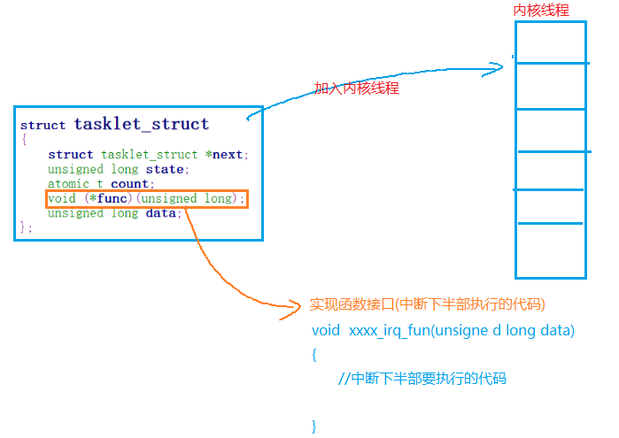
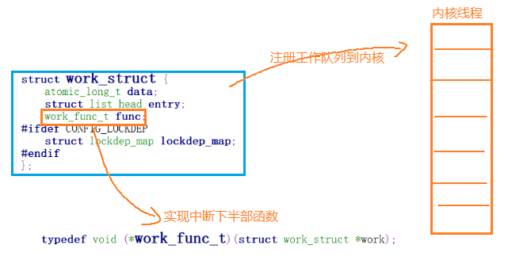

#### 一，阻塞IO和非阻塞IO的实现

##### 1，阻塞IO的实现

```
在linux应用编程中，有许多函数，比如：read(), accept(), connet(),recv(),recvfrom()默认都是阻塞IO函数，在内核中需要实现这些阻塞IO函数

//先定义返回的数据包
struct stm32mp157_key_data{
	int code;   //键值
	int value;  //松开 value=0，按下 value = 1
};

1》创建并初始化等待队列头
	init_waitqueue_head(struct wait_queue_head *wq_head)
	
2》实现阻塞IO函数  -----实现read接口
	//根据条件变量condition，决定是否让当前进程挂起
	wait_event_interruptible(struct wait_queue_head wq_head, int condition)	
	//参数1 ----等待队列头
	//参数2 ---- 挂起的条件，condition=0，则挂起，否则，直接返回。
	
    例如：
    ssize_t key_drv_read(struct file *filp, char __user *buf, size_t size, loff_t *flags)
    {
        int ret;
        printk("--------^_^ %s---------\n",__FUNCTION__);

        //如果have_data为0，则进程阻塞，返回直接返回
        wait_event_interruptible(key_dev->wq_head, key_dev->have_data);

        //将内核数据转为应用数据
        ret = copy_to_user(buf, &key_dev->key_data, size);
        if(ret > 0){
            printk("copy_to_user error");
            return -EINVAL;
        }

        //have_data置零
        key_dev->have_data = 0;

        return size;
    }
3》唤醒阻塞的进程  --- 中断处理函数中
	wake_up_interruptible(struct wait_queue_head * x)
	例如： 
	irqreturn_t key_irq_fun(int irqno, void * dev_data)
    {
        int value;
        printk("--------^_^ %s---------\n",__FUNCTION__);

        //获取中断引脚的数据
        value = gpiod_get_value(key_dev->gpioa);

        //根据value判断按键松开还是按下
        if(value){  //松开
            printk("key1 up\n");
            key_dev->key_data.code = KEY_1;
            key_dev->key_data.value = 0;
        }else{   //按下
            printk("key1 pressed");
            key_dev->key_data.code = KEY_1;
            key_dev->key_data.value = 1;
        }

        key_dev->have_data = 1;
        //唤醒阻塞的进程
        wake_up_interruptible(&key_dev->wq_head);
        return IRQ_HANDLED;
    }
	
```

##### 2，非阻塞IO

```
应用层：
	打开文件：fd = open("/dev/key01", O_RDWR); //默认以阻塞IO的方式读取数据
	打开文件：fd = open("/dev/key01", O_RDWR|O_NONBLOCK); //默认以非阻塞IO的方式读取数据

	read();   //上面两种不同的打开方式，使得read在读数据时，如果没有数据，阻塞的方式打开，则read会使进程阻塞，非阻塞的方式打开，则read会立即返回
	
	==============================================================================
驱动：
	ssize_t key_drv_read(struct file *filp, char __user *buf, size_t size, loff_t *flags)
    {
        int ret;
        printk("--------^_^ %s---------\n",__FUNCTION__);
       
	//判断应用层打开文件时，是否以非阻塞方式读取IO
	if((key_dev->have_data == 0) && (filp->f_flags & O_NONBLOCK))
		return -EAGAIN;

        //如果have_data为0，则进程阻塞，返回直接返回
        wait_event_interruptible(key_dev->wq_head, key_dev->have_data);

        //将内核数据转为应用数据
        ret = copy_to_user(buf, &key_dev->key_data, size);
        if(ret > 0){
            printk("copy_to_user error");
            return -EINVAL;
        }

        //have_data置零
        key_dev->have_data = 0;

        return size;
    }
	
```

#### 二，中断下半部

```
为了使中断处理过程尽可能快的结束，可以把中断处理中不太重要的代码放到其他地方来执行，把这种方式称为中断下半部。
在linux中，中断下半部有三种实现方式：
```

##### 1，方式一：使用tasklet实现

###### 1.1 原理



###### 1.2 实现

```
驱动中：
1》初始化tasklet对象
	void tasklet_init(struct tasklet_struct *t,void (*func)(unsigned long), 
																	unsigned long data)
	//参数1 -----tasklet对象地址
	//参数2 -----中断下半部执行函数的指针
	//参数3 -----传给中断下半部函数的参数，类似于pthread_create的最后一个参数
	
	例如： 
	tasklet_init(&key_dev->tesklet, key_irq_fun_down, 120);
	
2》实现中断下半部函数
	void key_irq_fun_down(unsigned long data)
    {
        printk("--------^_^ %s---------\n",__FUNCTION__);
        key_dev->have_data = 1;
        //唤醒阻塞的进程
        wake_up_interruptible(&key_dev->wq_head);
        printk("data = %d\n",data);
    }
3》在中断处理函数中启动中断下半部
	static inline void tasklet_schedule(struct tasklet_struct *t)
	例如： 
	irqreturn_t key_irq_fun(int irqno, void * dev_data)
    {
        int value;
        printk("--------^_^ %s---------\n",__FUNCTION__);

        //获取中断引脚的数据
        value = gpiod_get_value(key_dev->gpioa);

        //根据value判断按键松开还是按下
        if(value){  //松开
            printk("key1 up\n");
            key_dev->key_data.code = KEY_1;
            key_dev->key_data.value = 0;
        }else{   //按下
            printk("key1 pressed");
            key_dev->key_data.code = KEY_1;
            key_dev->key_data.value = 1;
        }

        //启动中断下半部
        tasklet_schedule(&key_dev->tasklet);

        return IRQ_HANDLED;
    }
```

##### 2, 方式二：工作队列实现中断下半部

###### 2.1 原理



###### 2.2 实现

```
struct work_struct {
/*	atomic_long_t data; */
	unsigned long data;

	struct list_head entry;
	work_func_t func;
#ifdef CONFIG_LOCKDEP
	struct lockdep_map lockdep_map;
#endif
};
1》初始化work_struct对象
	INIT_WORK(struct work_struct *_work, work_func_t _func)	
	例如：
	INIT_WORK(&key_dev->work, key_irq_fun_down);
2》实现中断下半部执行函数
	void key_irq_fun_down(struct work_struct *work)
    {
        printk("--------^_^ %s---------\n",__FUNCTION__);
        key_dev->have_data = 1;
        //唤醒阻塞的进程
        wake_up_interruptible(&key_dev->wq_head);

    }
3》启动中断下半部 ----在中断处理函数中
	schedule_work(&key_dev->work);
	
```

##### 3,方式三：使用中断线程实现下半部

###### 3.1  在申请中断时创建下半部线程

```
int request_threaded_irq(unsigned int irq, irq_handler_t handler,
			 irq_handler_t thread_fn, unsigned long irqflags,
			 const char *devname, void *dev_id)

例如：
ret = request_threaded_irq(key_dev->irqno, key_irq_fun, key_irq_fun_down, IRQF_TRIGGER_FALLING |IRQF_TRIGGER_RISING, "key1_irq", NULL);
	if(ret < 0){
		printk("request_irq error");
		goto err_gpio_put;
	}
```

###### 3.2 中断处理函数中唤醒 下半部

```
irqreturn_t key_irq_fun(int irqno, void * dev_data)
{
	printk("--------^_^ %s---------\n",__FUNCTION__);

	。。。。。。
	return IRQ_WAKE_THREAD;   //返回IRQ_WAKE_THREAD表示启动下半部
}
```

###### 3.3 实现下半部代码

```
irqreturn_t key_irq_fun_down(int irqno, void * dev_data)

{
	printk("--------^_^ %s---------\n",__FUNCTION__);
	key_dev->have_data = 1;
	//唤醒阻塞的进程
	wake_up_interruptible(&key_dev->wq_head);

	return IRQ_HANDLED;
}
```

#### 三，mmap实现

```
应用层：
	void *mmap(void *addr, size_t length, int prot, int flags,int fd, off_t offset);
	//参数1 ----- 指定要映射的虚拟空间起始地址，一般为NULL，系统自动分配
	//参数2 ----- 映射的空间大小
	//参数3 ----- 空间的访问权限：PROT_EXEC  PROT_READ PROT_WRITE PROT_NONE 
	//参数4 ----- 是否可以被共享：MAP_SHARED，MAP_PRIVATE
	//参数5 ----- 文件描述符
	//参数6 ----- 相对物理内存起始位置的偏移量
	//返回值 -----成功：映射的虚拟空间起始地址，失败:-1
--------------------------------------------------------------------------------------------
驱动：
	struct file_operations {
		int (*mmap) (struct file *, struct vm_area_struct *);
	}
	
	例如：
	int key_drv_mmap(struct file *filp, struct vm_area_struct *vma)
    {
        unsigned long addr;
        printk("---------^_^ %s--------------\n",__FUNCTION__);

        //1，获取物理内存
        addr = virt_to_phys(key_dev->virt);

        //2,映射物理内存到应用程序的虚拟空间去
        vma->vm_page_prot = pgprot_noncached(vma->vm_page_prot);
        return io_remap_pfn_range(vma, vma->vm_start, addr>> PAGE_SHIFT, vma->vm_end - vma->vm_start, vma->vm_page_prot);
    }
    long key_drv_ioctl(struct file *filp, unsigned int cmd, unsigned long args)
    {
        int ret;
        printk("---------^_^ %s--------------\n",__FUNCTION__);
        switch(cmd){
            case KEY_GET_IOC_DATE:
                ret = copy_to_user((void __user  *)args, key_dev->virt, strlen(key_dev->virt));
                if(ret > 0){
                    printk("copy_to_user error\n");
                    return -EINVAL;
                }
                break;
            default:
                printk("unknow cmd\n");
                break;
        }

        return 0;
    }
 
```

#### 四，多路复用

##### 1，概念

```
在linux应用开发中：
    需要同时监测多个IO端口是否有数据时，可以使用多路复用来监测，比如：网络编程中的：select和poll
```

##### 2，实现

```
1》应用层：
	#include <poll.h>
    int poll(struct pollfd *fds, nfds_t nfds, int timeout);
    //参数1 ----- 结构体指针：struct pollfd * ，要监测的文件描述及事件
    		  struct pollfd {
                   int   fd;         /* file descriptor */
                   short events;     /* requested events */
                   short revents;    /* returned events */
               };
    //参数2 ---- 要监测的文件描述符个数
    //参数3 ---- 超时监测：
    				 0  ---不阻塞，立即返回
    				-1 ---一直阻塞，直到有IO事件产生
    				>0 -----当timeout时间到时没有OI事件产生，则立即返回
    //返回值 ----- 成功：事件个数，失败：-1，超时：0

例如： 
	struct pollfd fds[2];
    //将需要监测的IO添加到fds中
    fds[0].fd =  STDIN_FILENO;
    fds[0].events = POLLIN;

    fds[1].fd = fd;
    fds[1].events = POLLIN;

	 while(1){
        //多路复用
        if(poll(fds,sizeof(fds)/sizeof(fds[0]),-1) < 0){
            perror("poll");
            exit(1);
        }
        //判断标准输入是否有数据
        if(fds[0].revents & POLLIN){
           	//进行IO操作
        }
        //判断按键是否有数据
        if(fds[1].revents & POLLIN){
        	//进行IO操作
        }

--------------------------------------------------------------------------------
2》驱动：
	static inline void poll_wait(struct file * filp, wait_queue_head_t * wait_address, poll_table *p)
	//参数1 ----- struct file结构体指针
	//参数2 ----- 等待队列头
	//参数3 ----- 列表
	
	例如： 
	__poll_t key_drv_poll(struct file *filp, struct poll_table_struct *wait)
    {
        __poll_t mask = 0;
        printk("---------^_^ %s--------------\n",__FUNCTION__);

        //将当前的等待队列头注册到轮询表中
        poll_wait(filp, &key_dev->wq, wait);

        if(key_dev->have_data)
            mask |= POLLIN;

        return mask;
    }

```

